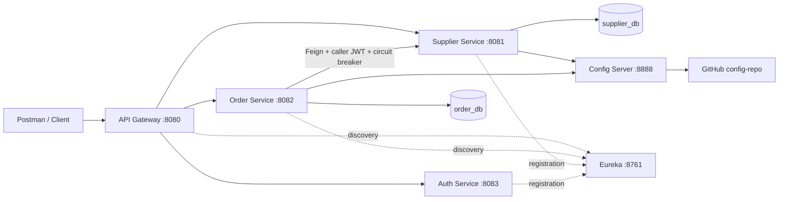

# Procurement System

A Java backend learning project for supplier management and purchase orders. Six Spring Boot services demonstrate REST APIs, separate databases, service discovery, centralized configuration, JWT authentication, scope-based authorization, and circuit-breaker recovery.

## Services

| Service | Port | Responsibility |
| --- | --- | --- |
| api-gateway | 8080 | Routes requests and validates JWTs |
| supplier-service | 8081 | Supplier CRUD, validation, and duplicate-code checks |
| order-service | 8082 | Create, retrieve, and cancel purchase orders |
| auth-service | 8083 | Authenticate local accounts, issue JWTs, publish public keys |
| discovery-server | 8761 | Eureka service registry |
| config-server | 8888 | Read service configuration from GitHub |

## Architecture



The gateway and both business services validate tokens. Order-service forwards the authenticated caller's token when checking a supplier. Database writes happen only after successful supplier verification.

## Technology

- Java 17 target; local development has also used JDK 21
- Spring Boot 4.1.1 and Spring Cloud 2025.1.x; exact versions are in each service's POM
- Spring MVC, Spring Data JPA, Hibernate, MySQL, Bean Validation
- Spring Cloud Gateway Server Web MVC, Eureka, Config, OpenFeign
- Resilience4j, Spring Security OAuth2 Resource Server, RS256 JWTs
- Maven Wrapper, Eclipse, Postman

## Local setup

### 1. Clone and import

Clone the repository and import each service into Eclipse using **File → Import → Maven → Existing Maven Projects**. Each service has its own POM and Maven Wrapper; there is no root aggregator POM.

```text
git clone https://github.com/Asit527/procurement-system.git
cd procurement-system
```

Requirements: JDK 17 or 21, MySQL running on localhost:3306, OpenSSL, and access to GitHub for Config Server.

### 2. Create databases

Run in your MySQL client:

```sql
-- Separate databases owned by each business service
CREATE DATABASE IF NOT EXISTS supplier_db;
CREATE DATABASE IF NOT EXISTS order_db;
```

Local datasource configuration uses MySQL username `root`. Change it in each service's application.properties if your installation uses a different account. Hibernate's `ddl-auto=update` creates/updates tables for local development.

### 3. Configure passwords

In **Eclipse → Run → Run Configurations → Spring Boot App → select service → Environment**, set:

| Service | Variable | Value |
| --- | --- | --- |
| supplier-service | DB_PASSWORD | Your MySQL password |
| order-service | DB_PASSWORD | Your MySQL password |
| auth-service | AUTH_PASSWORD | Your chosen asit account password |
| auth-service | VIEWER_PASSWORD | A different password for viewer |

Click **Apply** and restart affected services after changing environment variables. Use strong ASCII passwords within the login input's 64-character limit. Do not put actual passwords, tokens, or private keys into Git. Spring does not automatically load a `.env` file in this setup.

### 4. Create persistent signing keys

On macOS/Linux, run these commands **once on a new machine**. Do not overwrite existing keys when restarting the application.

```text
mkdir -p ~/.procurement/keys
openssl genpkey -algorithm RSA -pkeyopt rsa_keygen_bits:2048 -out ~/.procurement/keys/auth-private.pem
chmod 600 ~/.procurement/keys/auth-private.pem
openssl pkey -in ~/.procurement/keys/auth-private.pem -pubout -out ~/.procurement/keys/auth-public.pem
```

Auth-service reads these files from the Java process's user home. The private key signs tokens; only the public key is published at `http://localhost:8083/.well-known/jwks.json`. Keys remain outside this repository. Keeping the same key pair allows unexpired tokens to work across auth-service restarts.

### 5. Configuration repository

Config Server reads branch `main` of this repository and searches the `config-repo` directory:

- `config-repo/supplier-service.properties`: supplier port and Eureka address
- `config-repo/order-service.properties`: order port, Eureka address, and Feign timeouts

If using a fork, update `spring.cloud.config.server.git.uri` in config-server's application.properties. Commit and push central configuration changes so Config Server can fetch them. Restart client services to apply changes; automatic refresh is not configured.

Supplier-service and order-service use a required `spring.config.import=configserver:http://localhost:8888`, so Config Server must be available at their startup. Database passwords stay in local environment variables.

### 6. Startup order

Start MySQL, then run the main classes in Eclipse in this order:

1. ConfigServerApplication — config-server
2. DiscoveryServerApplication — discovery-server
3. AuthServiceApplication — auth-service
4. SupplierServiceApplication — supplier-service
5. OrderServiceApplication — order-service
6. ApiGatewayApplication — api-gateway

Allow time for Eureka registration and discovery caches to update, usually around 30 seconds. View the registry at `http://localhost:8761`.

Alternatively, run `./mvnw spring-boot:run` from each service directory in a separate terminal, with its required environment variables already set. Windows uses `mvnw.cmd`.

## Login and permissions

Use Postman **POST**, **Authorization → No Auth**, **Body → raw → JSON**:

```text
http://localhost:8080/api/auth/login
```

```json
{
  "username": "asit",
  "password": "REPLACE_WITH_YOUR_AUTH_PASSWORD"
}
```

Replace the password placeholder locally. For viewer, use username `viewer` and the configured VIEWER_PASSWORD.

A successful response contains `accessToken`, `tokenType` (`Bearer`), and `expiresIn` (`900` seconds). Copy only the token value into Postman's **Authorization → Bearer Token** field. Do not include quotes or an extra Bearer prefix.

| Account | Scope | Allowed operations |
| --- | --- | --- |
| asit | procurement.read procurement.write | Read and write supplier/order APIs |
| viewer | procurement.read | Read supplier/order APIs |

Tokens use RS256, issuer `http://localhost:8083`, and audience `procurement-api`. Signature, issuer, audience, and expiration are validated. There is no refresh-token endpoint; log in again after expiry. These permissions are scopes, not separate ROLE_ADMIN authorities.

## API reference

Use gateway base URL `http://localhost:8080`. Supplier/order endpoints require a bearer token.

| Method | Path | Expected success |
| --- | --- | --- |
| POST | /api/auth/login | 200, token response |
| POST | /api/suppliers | 201, created supplier |
| GET | /api/suppliers | 200, supplier list |
| GET | /api/suppliers/{id} | 200, supplier |
| PUT | /api/suppliers/{id} | 200, updated supplier |
| DELETE | /api/suppliers/{id} | 204, empty body |
| POST | /api/orders | 201, created order |
| GET | /api/orders | 200, order list |
| GET | /api/orders/{id} | 200, order |
| PATCH | /api/orders/{id}/cancel | 200, cancelled order |

Replace `{id}` with an actual numeric ID; do not paste placeholders literally into Postman URLs.

Supplier POST/PUT body:

```json
{
  "supplierCode": "DEMO001",
  "supplierName": "Demo Supplier"
}
```

Create a supplier first and use its returned ID in the order body. This example assumes the returned ID is 2:

```json
{
  "supplierId": 2,
  "itemName": "Keyboard",
  "quantity": 2,
  "unitPrice": 1500.00
}
```

The total is calculated as quantity × unitPrice using BigDecimal. New orders have status CREATED. Cancellation changes status to CANCELLED and preserves the record. Cancellation requires no request body. Every successful order POST creates a new order.

Handled responses include 400 for invalid business input, 401 for invalid credentials or missing/invalid tokens, 403 for insufficient scope, 404 for missing resources, 409 for duplicate supplier codes, and 503 when supplier verification is unavailable. Some framework-level malformed-request errors may currently appear as 403 because the default error dispatch is denied by security.

## Demonstration checklist

These scenarios have been exercised manually during development; this is not an automated test report.

1. Log in as asit; create a supplier, then an order using its ID.
2. Read suppliers and orders through the gateway.
3. Cancel an order and GET it again to verify CANCELLED.
4. Submit blank supplier fields and reuse another supplier's code to check validation/conflict responses.
5. Request a business endpoint without a token or with `invalid-token`: expect 401.
6. Verify direct business ports 8081 and 8082 also reject missing tokens.
7. Log in as viewer: GET should return 200; order POST should return 403.
8. Repeat order POST as asit: expect 201.
9. Obtain a token, restart auth-service, and reuse it before its 15-minute expiry.
10. Check Config Server responses at `/supplier-service/default` and `/order-service/default` on port 8888; propertySources should be non-empty.

### Circuit-breaker test

With a valid asit token, stop supplier-service and submit order requests. Supplier verification should return 503 and no order should be saved.

The `supplierLookup` breaker uses a count-based window of 5 calls, a minimum of 5 counted calls, a 50% failure threshold, a 10-second open period, and 2 half-open trial calls. Missing-supplier 404 exceptions are ignored by the breaker. Feign connection/read timeouts are 3/5 seconds.

To observe state changes, temporarily set `logging.level.io.github.resilience4j.circuitbreaker=DEBUG` in order-service and restart it. Five failed lookups from a fresh breaker open the circuit; a subsequent request during the open period is rejected without a supplier call. Restart supplier-service, allow discovery to update, and make successful trial requests to close the circuit. Successful POST trials create orders. Restore INFO logging afterward.

## Troubleshooting

| Symptom | Check |
| --- | --- |
| AUTH_PASSWORD, VIEWER_PASSWORD, or DB_PASSWORD unresolved | Set the variable on the correct Eclipse run configuration and restart |
| Cannot load signing key | Ensure both PEM files exist under the Java user's `.procurement/keys` directory |
| Config Server startup/import error | Start port 8888 first; check GitHub access, branch, and config-repo files |
| Eureka connection refused | Start discovery-server on 8761 |
| 401 with a token | Get a fresh token; paste only its value; verify issuer, audience, and public-key endpoint |
| Viewer gets 403 on POST | Expected: viewer only has read permission |
| Login fails | Use POST, No Auth, and a JSON body with the configured account password |
| Feign supplier verification returns 503 | Check supplier registration, token forwarding, downstream logs, and circuit state |
| Java import cannot be resolved | Put starter dependencies in the main dependencies block and update Maven |
| Package mismatch | Match the Java package declaration to its source directory |

## Current limits and follow-up work

This is a local demonstration, not a production deployment:

- Authentication uses two in-memory accounts and a custom login endpoint, not a complete OAuth2/OIDC authorization server. No registration, refresh tokens, revocation, lockout, or rate limiting is implemented.
- Signing keys are persistent local files; managed storage and key rotation are not implemented. Local traffic uses HTTP.
- Config Server and Eureka are local infrastructure without configured authentication. Do not expose them publicly as-is.
- Supplier duplicate prechecks are not atomic with database writes; concurrent conflicts need consistent database-exception handling.
- Supplier deletion does not coordinate with existing orders. There is no distributed transaction or supplier-name snapshot.
- Order cancellation is a basic status update; no optimistic locking, approval workflow, idempotency key, pagination, or order editing is implemented.
- Supplier lookup currently maps most Feign errors, including downstream authentication errors, to 503.
- Schema updates use Hibernate ddl-auto=update instead of versioned migrations.
- Generated tests exist, but a comprehensive automated suite and CI pipeline have not been verified. Deployment automation, Docker, and production observability remain future work.

## Repository layout

```text
procurement-system/
├── api-gateway/
├── auth-service/
├── config-server/
├── discovery-server/
├── order-service/
├── supplier-service/
├── config-repo/
└── README.md
```
